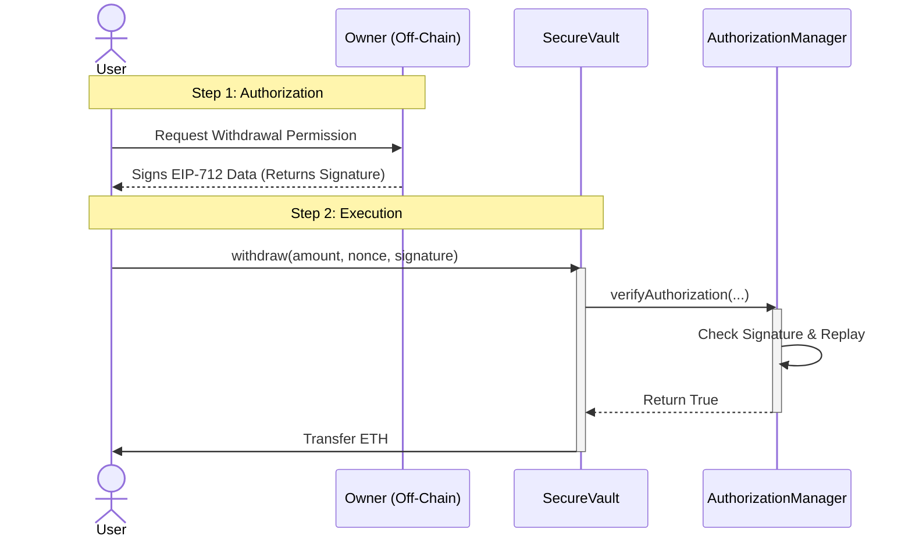

# Authorization-Governed Vault System

## 1. Project Overview
This project implements a secure, decentralized vault architecture that strictly separates **Asset Custody** (SecureVault) from **Permission Validation** (AuthorizationManager). 

The system enforces that funds can only be withdrawn when a valid **EIP-712** signature, generated off-chain by the owner, is presented. This design mimics production-grade Multi-Party Computation (MPC) or centralized-authority setups common in institutional DeFi.

## 2. Architecture & Design

### Components
1.  **AuthorizationManager (The Policy Engine)**
    * Responsible for cryptographic verification.
    * Stateless logic for signature recovery using `ECDSA` and `EIP-712`.
    * Stateful logic for **Replay Protection** (tracking used nonces/hashes).
    * Does *not* hold funds.

2.  **SecureVault (The Custodian)**
    * Holds ETH assets.
    * Contains zero cryptographic logic (Separation of Concerns).
    * Queries `AuthorizationManager` to approve withdrawals.
    * Follows the **Checks-Effects-Interactions** pattern to prevent reentrancy.

### Security Mechanisms

#### A. Replay Protection
We do not use a simple incrementing nonce per user. Instead, we hash the entire authorization payload:
`hash = keccak256(vault, recipient, amount, nonce, deadline)`

This hash is marked as `true` in a mapping `isAuthUsed[hash]` inside `AuthorizationManager` immediately upon verification. This guarantees that a signature can be used **exactly once**.

#### B. Domain Binding (Anti-Phishing)
The EIP-712 implementation binds the signature to:
* **Chain ID:** Prevents a testnet signature from being used on mainnet.
* **Verifying Contract:** Prevents a signature for "Vault A" from being used on "Vault B".

#### C. Expiry
Every authorization includes a `deadline`. If the transaction is mined after this timestamp, the `AuthorizationManager` reverts with `DeadlineExpired()`.

## 3. Setup & Deployment

### Prerequisites
* Docker & Docker Compose
* Node.js (for local testing without Docker)

### Running with Docker (Preferred)
This command will spin up a local blockchain, deploy contracts, and expose the RPC.

```bash
docker-compose up --build
```
### Expected Output:
AuthorizationManager deployed to: 0x...

SecureVault deployed to: 0x...

Vault funded with 10 ETH

Node is running at [http://0.0.0.0:8545](http://0.0.0.0:8545)

### Running Tests Locally

We have included comprehensive integration tests covering successful withdrawals, replay attacks, and data tampering.

```bash
npm install
npx hardhat test
```

## 4. Manual Interaction Flow (Step 7 Validation)

To generate an authorization signature off-chain without a frontend, use the included script:

Ensure the local node is running (via Docker or npx hardhat node).

Run the signing script:

```bash

npx hardhat run scripts/sign.js --network localhost
```

Output: The script will print the specific Signature, Nonce, and Deadline.

Action: Use these values to call withdraw() on the Vault contract via Etherscan, Remix, or Console.

## 5. Technology Stack

* **Solidity 0.8.20**

* **Hardhat**

* **Ethers.js v6**

* **Docker**

* **OpenZeppelin Contracts (EIP712, ECDSA, ReentrancyGuard, Ownable)**

## 6. Interaction Flow Diagram


---
